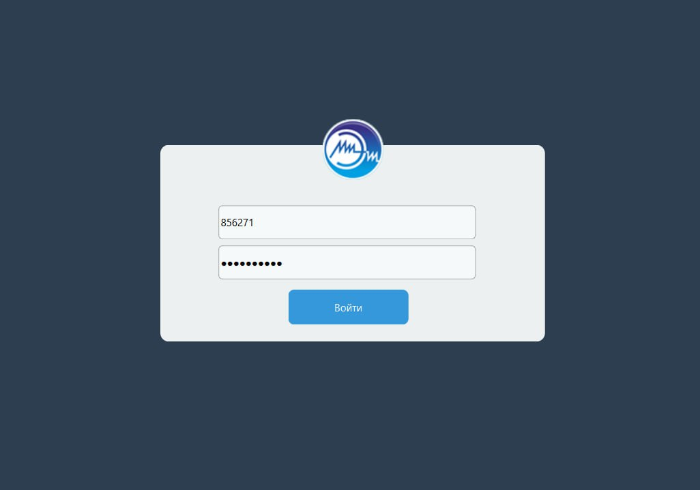
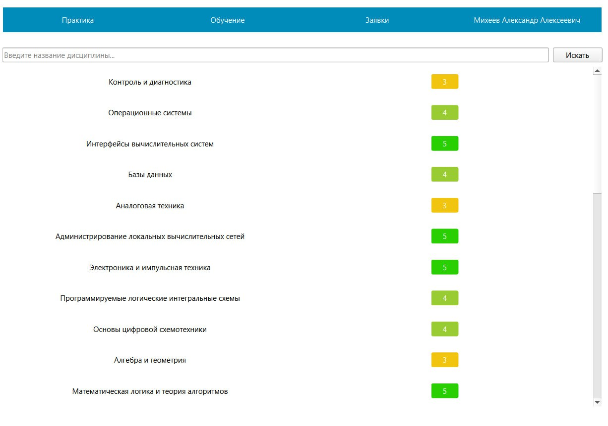
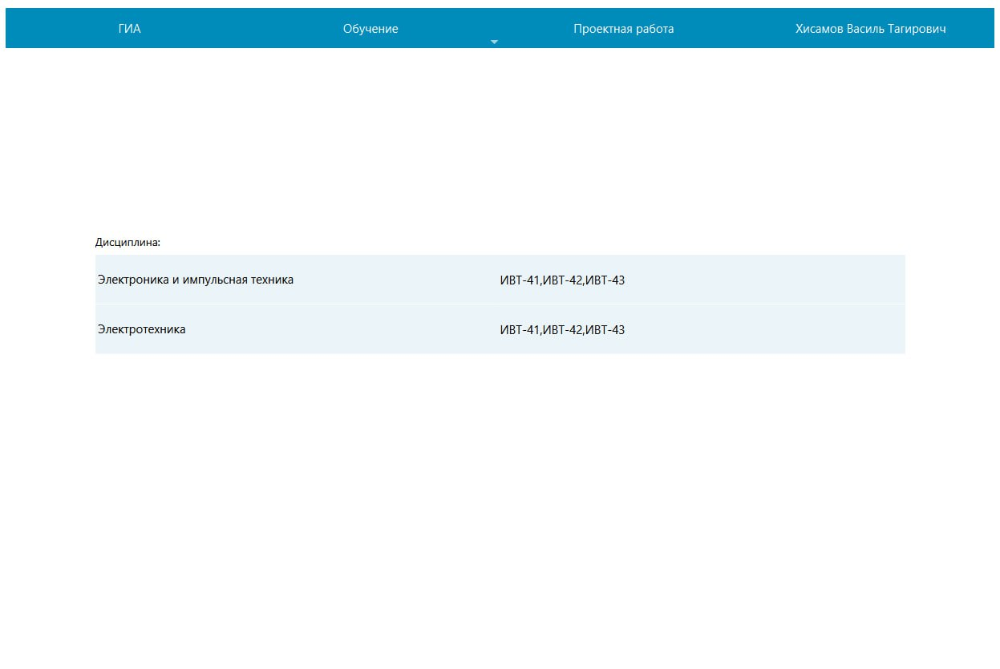
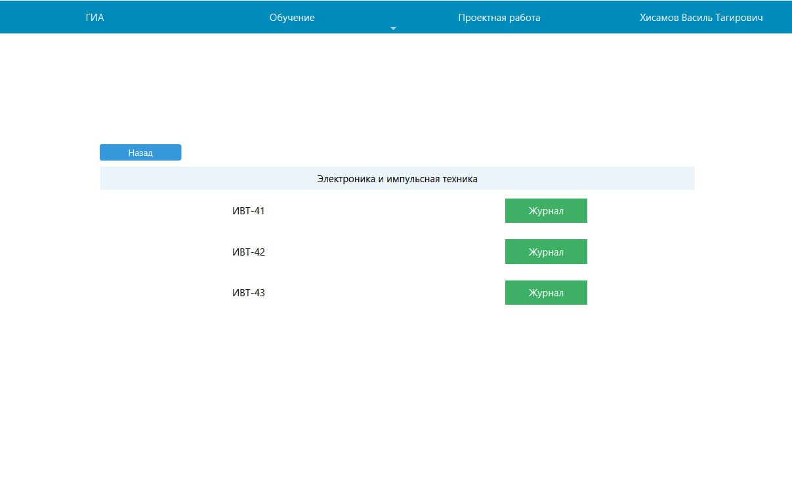
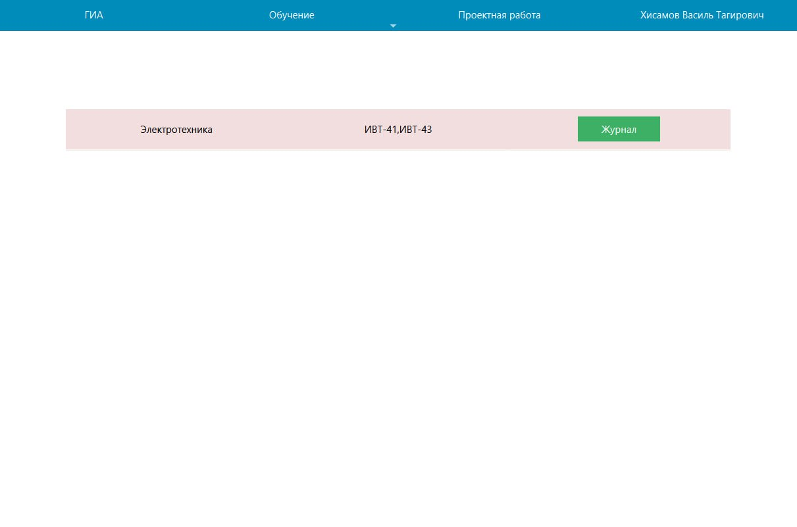
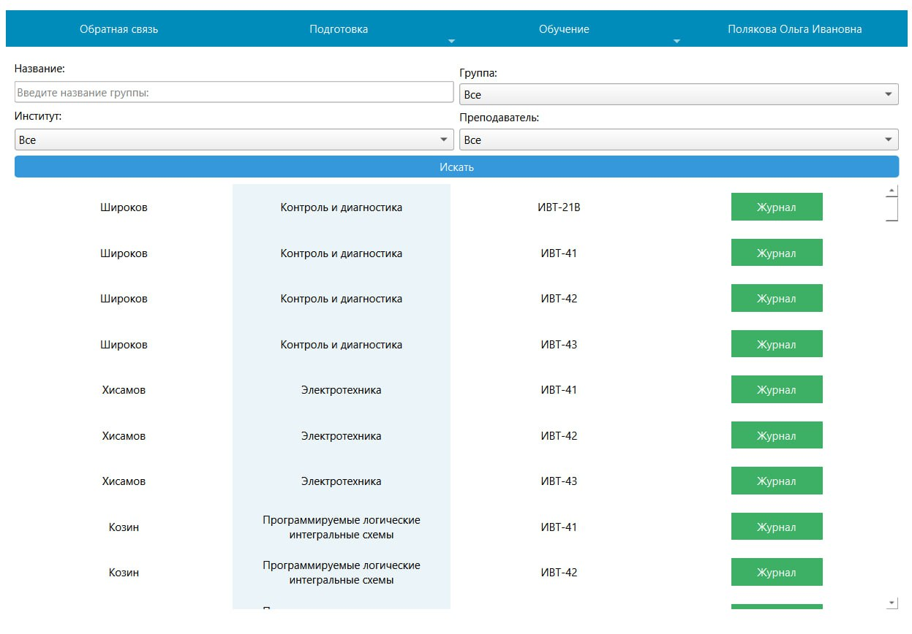
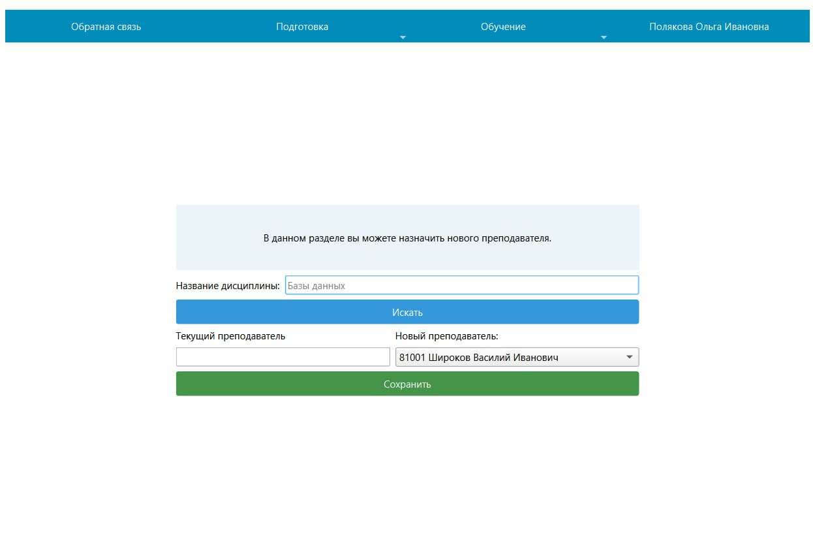

# Симулятор ОРИОКСа

## Для курса "Базы данных"

Привет! Этот небольшой гайд создан для того, чтобы разобраться в работе Qt-аналога ориокса, созданного в учебных целях для данного курса.

# Содержание

1. [Введение](#введение)
2. [Общие сведения](#основная-часть)
    1. [Взаимодействие с SQL](#sql)
        * [Подключение к серверу PostgreSQL](#sql)
        * [SQLQuery](#query)
    2. [Таблицы, таблицы и еще раз таблицы](#frotend)
    3. [Базовые структуры](#structs)
3. [Возможности пользователя](#software)
    1. [Форма логина](#loginform)
    2. [Студент](#student)
    3. [Преподаватель](#teacher)
    4. [Методист](#methodist)
4. [FAQ](#other)

## Введение

ОРИОКС является отличным примером для демонстрации того, как базы данных участвуют в разработке любого продукта. На примере данной программы Вы узнаете, что на самом деле происходит, когда вы заходите в свою учетную, где хранятся оценки и списки студентов и как можно все это взломать.
Данное программное обеспечение было написано при помощи фреймворка Qt, с которым Вы уже работали раннее. Архитектура приложения выстраивалась с использованием объектно-ориентированного подхода (ООП).

## Общие сведения

### Взаимодействие с SQL

#### Подключение к серверу PostgreSQL

Для того чтобы работать с PostgreSQL из под Qt, я использовал библиотеку psql. Подробно о том, как подготовить Qt Creator к работе с ней, Вы можете ознакомиться в тексте лабораторного практикума.

Прежде всего, рассмотрим, как реализован "мост" между сервером PostgreSQL и Qt. Реализация описана в файлах **sqlservice.h** и **sqlservice.cpp**. Для того чтобы была возможность работать с базой данных, подключается следующий заголовочный файл:

```cpp
#include <QSqlDatabase>
```

Подключение к серверу PostgreSQL и, соответственно, к базе данных, производится в теле данной функции:

```cpp
void databaseConnect(); // Функция подключения к базе данных
```

Внутри данной функции производится инициализация объекта с именем *db* типа *QSqlDatabase*:

```cpp
 db = QSqlDatabase::addDatabase("QPSQL"); // Инициализирую базу данных при помощи "QPSQL"
```

 Через данный объект и будет производиться установка соединения с базой данных на сервере.

 Далее у данного обьекта производится установка параметров подключения через методы *setHostName*, *setDatabaseName*, после чего при помощи метода *open()*
 производится попытка установить соединение. Данный метод имеет тип bool и возвращает true или false. Именно этим фактом я воспользовался, для того чтобы проверить, установилось ли соединение с БД:

 ```cpp
 if (!db.open()) {
        qDebug() << "Failed to connect to database.";
        qDebug() << "Error: ";
        qDebug() << db.lastError().text();
    } else {
        qDebug() << "Connected to database succesfully!";
    }
 ```

#### SQLQuery

Работа с SQL, конечно же, подразумевает выполнение SQL-запросов. Давайте разберемся, как такая возможность реализована в данном программном обеспечении. Следующий заголовочный файл является частью библиотеки psql и позволяет выполнять SQL-запросы:

```cpp
#include <QSqlQuery> // query (от англ.) - очередь, запрос
```

В файле `sqlservice.h` объявлена функция `runQuery`, внутри которой описан пример логики выполнения SQL- запроса. Ниже приведен ее код с комментариями, подробно описывающими суть происходящего:

```cpp
QSqlQuery SqlService::runQuery(QString content) {
    
    // Пример выполнения SQL-запроса
    
    QSqlQuery query; 
    
    // Обьект класса QSqlQuery позволяет выполнять SQL-запросы,
    // хранит в себе "таблицу", полученную после sql-запроса
    
    query.exec(content); // Метод exec() принимает на вход текст запроса

    // Смотрим, выполнился ли запрос успешно:

    if (query.lastError().isValid()) {
        qDebug() << "Ошибка выполнения запроса:" << query.lastError().text();
    } else {
        // Запрос выполнен успешно
    }
    return query; // Возвращает 
}
```

Замечу, что конкретно данная функция в ходе работы приложения использоваться не будет и приведена лишь в ознакомительных целях. Однако, концепция выполнения запроса будет именно такая. О том, как именно будут выполняться запросы и как будет производиться **обработка** результата запроса будет расказано далее.

#### Prepare и bind value

Как мы уже рассмотрели раннее, запрос выполняется следующим образом:

```cpp
query.exec(content); // Метод exec() принимает на вход текст запроса
```

При этом текст запроса может иметь примерно такой вид:

```SQL
SELECT password, acess_level 
FROM users 
WHERE login = '123456'
```

Здесь четко указано, что необходимо найти все записи, логин - 123456, однако, в 99% случаев заранее неизвестно, какое именно значение параметра нам нужно. Более того, такой запрос не является гибким и, по сути, является хардкодингом. Соответственно, возникает проблема, как формировать запрос так, чтобы в него можно было всегда подставить нужное значение параметра поиска?

На помощь приходит метод `prepare()` класса `QSqlQuery`. Рассмотрим пример его применения (взят из `loginform.cpp`):

```cpp
QSqlQuery login_query;
login_query.prepare("SELECT password, acess_level FROM users "
                    "WHERE login = :login"); 
                    // Подготавливаем запрос

```

Теперь, вместо `:login` всегда можно подставить то, что нам нужно при помощи метода `bindValue()`:

```cpp
QString requested_login = ... // Какая-то строка с данными
login_query.bindValue(":login", requested_login); // Биндим
```

По такой же логике переменных может быть несколько и для каждой устанавливается значение при помощи `bindValue()`.

#### Как обрабатывать запрос?

Мы научились делать SQL-запрос, теперь пришло время узнать, как достать полученные данные и как с ними работать.

Напомню, для того чтобы сделать запрос в простейшем случае необходимо выполнить следующую последовательность команд:

```cpp
QString content = '...';
QSqlQuery query; 
query.exec(content);
```

После запуска запроса внутри объекта query будет храниться **результат выполнения запроса**. Возможно 3 сценария:

* Пустой ответ из за ошибки (метод `lastError()` в помощь)
* Пустой ответ, так как нет ни одной удовлетворяющей запросу записи в таблице
* Вернулся ответ в виде специально форматированной таблицы.

Для того, чтобы распарсить результат выполнения запроса обычно используется следующая конструкция (пример взят из `subjectselection.cpp`)

```cpp
QSqlQuery groups_query;
QString subject;
groups_query.prepare("Текст запроса с переменной :subject");
groups_query.bindValue(":subject", subject);
groups_query.exec();

// Парсим результат
// Получаем строки из таблицы, которая вернулась после запроса
// Делаем это до тех пор, пока не дойдем до конца таблицы

 while (groups_query.next()) {
    QString group_name = groups_query.value(0).toString();
    ...
}
```

При помощи метода `next()` внутри объекта groups_query происходит смещение внутреннего итератора на следующую строку возвращенной после запроса таблицы. Метод `value()` нужен для того чтобы получить конкретное значение из текущей строки. Например, в примере выше groups_query.value(0) вернет значение из первого столбца.

### Таблицы, таблицы и еще раз таблицы

Раз уж речь зашла о базах данных, наверняка придется работать с таблицами. Для того чтобы представлять результат SQL запроса в графическом интерфейсе, необходим механизм, который будет представлять данные в табличном формате. В Qt представление данных в виде таблицы можно реализовать при помощи **QTableWidget**. Ниже приведен пример отображения списка дисциплин, полученного из SQL-запроса при помощи виджета класса QTableWidget:

**Здесь должен быть скриншот из интерфейса учителя \ методиста**

В процессе работы с данной программой Вы не раз встретите подобные таблицы (очень много раз), и было бы неплохо разобраться, как с ними работать.

#### Создание виджета

Поскольку этот софт создавалася в Qt Creator, в котором есть встроенный Qt Designer, размещение необходимых виджетов сильно упрощено, достаточно просто найти QTableWidget на панели слева и перетянуть его на форму, а не создавать данный виджет программно вручную.

После того, как виджет размещен на форму, нужно дать ему имя, поскольку виджет - это тоже объект, также как и любой другой обьект класса или переменнная. Сделать это можно вот здесь, выбрав виджет таблицы в списке виджетов формы справа или просто нажав на него в форме:


> Здесь атрибут objectName хранит в себе имя таблицы (объекта).

Теперь, когда есть виджет таблицы, можно заполнять его данными, однако, сначала необходимо настроить его поведение (количество столбцов, имена столбцов, высота ячейки, равномерное растяжение таблицы по ширине и другие). На примере таблицы выше рассмотрим, как это сделать. Данная таблица взята из файла класса `subjectmoderation.h`. Внутри класса описан следующий метод:

```cpp
void SubjectsModeration::configureTableParameters() {
    // Устанавливаю количество столбцов
    ui->subjects_table->setColumnCount(4);

    // Отключаю отображение названий столбцов 
    ui->subjects_table->horizontalHeader()->setVisible(false);
    ui->subjects_table->verticalHeader()->setVisible(false);

    // Отключаю отображение сетки
    ui->subjects_table->setShowGrid(false);

    ... // Часть функции временно опущена
}
```

Для того чтобы получить доступ к объекту таблицы, который был размещен на форме, используется приватный атрибут класса `ui`.
В приведенном выше фрагменте кода таблицы устанавливается 4 столбца, название столбцов было отключено за ненадобностью, также была отключена дефолтная сетка.

Для того чтобы содержимое таблицы автоматически подгонялось под размер окна по горизонтали, используется следующая команда:

```cpp
ui->subjects_table->horizontalHeader()->setSectionResizeMode(номер_столбца, QHeaderView::Stretch); // Выставляем QHeaderView::Stretch для каждого столбца
```

#### Делегаты

К сожалению (опредёленно), для того чтобы настроить гибкое поведение таблицы, иногда может быть недостаточно вызвать какой-либо метод таблицы и что - либо туда передать. Например, при разработке данного приложения, я столкнулся со следующей проблемой: нужно было сделать так, чтобы текст в каждой ячейке данного столбца выравнивался по вертикали. Оказалось, что такая тривиальная задача не имеет тривиального решения. Один из способов - пройтись по всем ячейкам столбца в цикле и установить выравнивание ячейки по центру, однако такой подход, на мой взгляд, является костыльным. Другим способом является использование так называемых `делегатов`.

> Делегат - это специальный класс, позволяющий кастомизировать поведение таблицы, ячеек, групп ячеек и т.д

Я не буду вдаваться в подробности их работы, поскольку это не особо то и нужно, для понимания важно лишь то, что при установке делегата для столбца для каждой его ячейки применяются правила, описанные внутри делегата. Например:

```cpp
 ui->subjects_table->setItemDelegateForColumn(0, new CenterAlignmentDelegate());
```

Здесь для первого столбца таблицы (нулевой индекс - первый столбец) устанавливается делегат класса `CenterAlignmentDelegate`. Как уже можно догадаться из названия, данный делегат выравнивает содержимое ячеек таблицы по центру.

Ознакомиться со всеми имеющимися делегатами можно ознакомиться в папке `tables_stuff`.

#### Добавление новой записи в таблицу

Для того чтобы добавить новые записи в таблицу, необходимо сделать как минимум 2 вещи:

1. При помощи `insertRow` вставить новую строку в таблицу;
2. Заполнить содержимое строки, обратившись к каждой ячейке в строке при помощи метода `setItem` или `setCellWidget` (если нужно установить виджет в ячейку, например, кнопку).

Пример:

```cpp
int rows = 0; // Счетчик количества строк в таблице 

while (subjects_query.next()) {
        ui->subjects_table->insertRow(rows);
        ui->subjects_table->setRowHeight(rows, 50); // Высота

        ...

        ui->subjects_table->setItem(rows, 0, new   QTableWidgetItem(teacher_surname));
        ui->subjects_table->setItem(rows, 1, new QTableWidgetItem(subject_name));
        ui->subjects_table->setItem(rows, 2, new QTableWidgetItem(group_name));
        ui->subjects_table->setCellWidget(rows, 3, 
        button_container);
```

Поскольку данные в ячейках таблицы должны иметь тип QTableWidgetItem или тип Widget (кнопки и т.д), при вставке нового элемента создается объект типа QTableWidgetItem, в конструктор класса передается, как правило, строка QString с текстом, который мы хотим видеть в данной ячейке.

#### Очистка таблицы

У таблицы QTableWidget нет метода clear() или чего-то похожего. Одним из способов удалить все записи из таблицы - установить количество строк равное нулю:

```cpp
ui->subjects_table->setRowCount(0);
```

### Базовые структуры

Для удобства работы я выделил некоторые сущности в отдельные структуры.

#### User

Данная структура создана для того чтобы удобно хранить информацию о текущем пользователе системы (информацию о ФИО, номере студенческого билета (для студентов), айди преподавателя (для преподавателей), уровне учетной записи и т.д).

Описание данной структуры можно найти внутри файла `user.h`.

#### Subject

Данная структура создана для того чтобы удобно хранить информацию о каком-либо предмете из базы данных (название предмета, его id). Также внутри класса определен оператор <:

```cpp
bool operator< (const Subject& other) const {
        if (subject_id < other.subject_id)
            return true;
        return false;
```

Это сделано для того, чтобы можно было использовать сортировку по отношению к предметам по номеру предмета в системе.

## Функционал приложения

Теперь пройдемся по основному функционалу симулятора ОРИОКСа.

### Форма логина

Как и в оригинальном, первым делом нас встречает форма логина, где необходимо ввести логин и пароль от учетной записи.



Реализация формы логина описана в следующих классах:

* loginform.h;
* loginform.cpp;
* loginform.ui.

Рассмотрим её чуть более подробно.

Для того чтобы соотнести уровень доступа учетной записи с ее привилегиями используется следующее перечисление:

```cpp
enum AcessLevel {
    student, teacher, methodist
};
```

Также внутри формы логина хранится информация о текущем пользователе в аттрибуте типа User:

``` cpp
 User current_user_;
```

Внутри конструктора класса происходит связь кнопки авторизации и запуска функции обработки запроса на авторизацию при помощи connect. Подробнее о том, как работать с connect вы можете прочитать здесь. Также внутри конструктора в секции кода *debug purposes only* содержатся данные от 3 учетных записей с разными уровнями доступа: студента, преподавателя и методиста.

Внутри функции `authoriseRequested()` происходит обработка запроса аутентификации при помощи SQL-запроса. Принцип его работы следующий:

* Из полей ввода логина и пароля производится сбор данных;
* Выполняется SQL запрос для получения настоящего пароля по данному логину;
* Полученный посредством запроса пароль сравнивается с введенным.

### Студент



### Преподаватель




**Скрин должника**


### Методист

**Скрин выбора дисциплины**


**Скрин назначения дисциплины**
**Скрин журнала**



## FAQ

#### Как выполнить SQL-запрос?

#### Что такое connect и как он работает?
